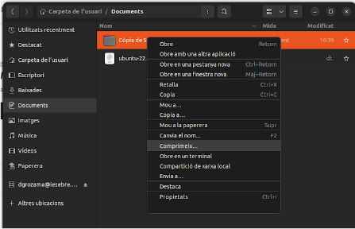

# CAS PRÀCTIC 1

## INDEX
- Perquè penseu que aquesta és una bona solució al nostre problema.	
- El pressupost mensual i anual de la despesa del servei a contractar.	
- Guia de creació de l’usuari administrador/a i usuari/a (Feu servir els comptes de correu de l’Institut).	
- Guia de creació de les unitats compartides BACKUP i DOCUMENTS on es vegin els permisos assignats a cada tipus d’usuari/a.
- Guia d’instal·lació d’adreces directes als escriptoris dels dos tipus d’usuaris:	
- Exemples d’ús de fer un backup per part de l’administrador/a.	
- Exemples d’ús de consultar un document per part de l’usuari/a.	
- Comproveu si un usuari/a pot eliminar sense voler algun document.

---

**1-Perquè penseu que aquesta és una bona solució al nostre problema.**

El meu grup i jo creiem que sí que és una bona idea, perquè podem tenir una còpia de seguretat físicament en un disc dur i també la podem tenir al núvol.
Si algun dia hi ha un problema amb una de les còpies de seguretat podem estar tranquils perquè sabem que tenim una altra guardada.

**2-El pressupost mensual i anual de la despesa del servei a contractar.**

Aquest és el nostre pressupost, en la captura podem observar que per més ens val 9,36€

**3-Guia de creació de l’usuari administrador/a i usuari/a (Feu servir els comptes de correu de l’Institut).**

L’usuari administrador, que en el nostre cas és David ha de crear una nova carpeta.

Una vegada creada hem de fer les dos “Unitats” la de Backup i la de Documents, que sols l’administrador té permisos d’edició.

I com podem veure l’administrador té permissos a tot i l’usuari sols té permissos de lectura.

**4-Guia de creació de les unitats compartides BACKUP i DOCUMENTS on es vegin els permisos assignats a cada tipus d’usuari/a.**

Primer creem les carpetes Backup i Documents

Una vegada creades posem els permisos per als usuaris Administrador i Usuaris.

**5-Guia d’instal·lació d’adreces directes als escriptoris dels dos tipus d’usuaris:** Administrador/a i usuari/a.

El primer que hem de fer es obrir el paràmetres de l’ordinador i anem a “comptes en linea”.

Ens connectarem a google amb la cuenta de l’institut.

Desprès d’inicia sessió li donem a permetre

Aqui decidirem què volem que ens aparèixer, en el nostre cas sol volem els fitxers

Ara en apareixerà el nostre drive a les carpetes del nostre ordinador.

Entrem dins de la carpeta on tenim la nostra copia de seguretat i ho arrastrem a la vora per a poder accedir més ràpid

Quedaria així.

**6-Exemples d’ús de fer un backup per part de l’administrador/a.**

Per poder fer un backup d’alguna cosa primer hem de fer una carpeta amb el nom de Còpia de Seguretat 001.

Després li donem a Comprimeix…

I finalment ho movem a Backup.

**7-Exemples d’ús de consultar un document per part de l’usuari/a.**

Entrem dins de la carpeta de Documents i entrem dins del document que es diu “exemple”

Sol puc visualitzar el document, no puc editar.

**8-Comproveu si un usuari/a pot eliminar sense voler algun document.**

Si un usuari entra a la carpeta de Backup i intentar eliminar algo li apareixerà bloquejat perquè no té els permisos.

